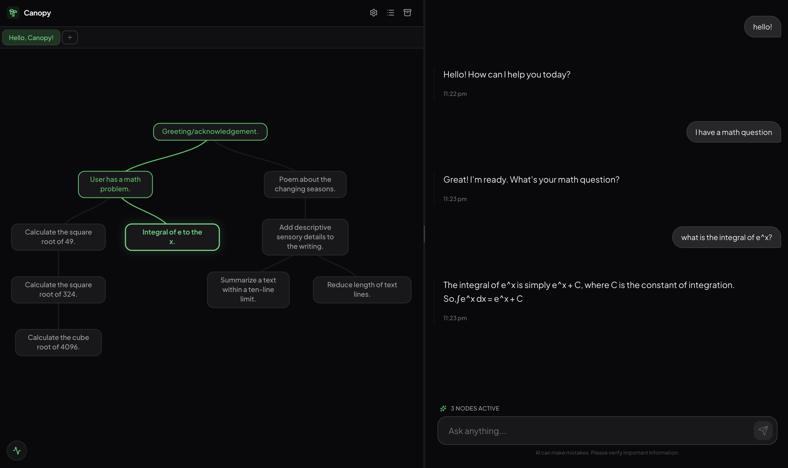

# Canopy

Canopy is a conversational interface that lets you branch your chats into trees.

Standard chat interfaces are linear, making it hard to explore multiple ideas in parallel without losing context. Canopy solves this by visualizing your conversation as a tree. You can branch off from any message to explore a new direction, while keeping the context of previous messages intact.

Powered by Google Gemini.

## User Interface



## Features

*   **Branching**: Create new branches from any message to explore alternative paths.
*   **Graph Visualization**: See your entire conversation thread as a navigable tree.
*   **Local Storage**: All data (projects, API keys, chat history) is stored locally in your browser.
*   **Markdown & LaTeX**: Full support for code blocks and math rendering.
*   **Theming**: Dark/Light mode support.

## Stack

*   React 19 + Vite
*   Tailwind CSS (via CDN)
*   D3.js
*   Google GenAI SDK

## Run Locally

You'll need a Google Gemini API Key from [AI Studio](https://aistudio.google.com/app/apikey).

1.  **Clone and install**
    ```bash
    git clone https://github.com/dzhang3701/canopy.git
    cd canopy
    npm install
    ```

2.  **Set up API key**
    Create a `.env.local` file in the root directory:
    ```
    VITE_GEMINI_API_KEY=your_key_here
    ```

3.  **Run**
    ```bash
    npm run dev
    ```